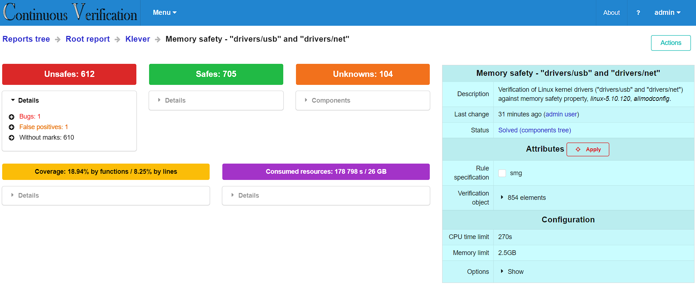
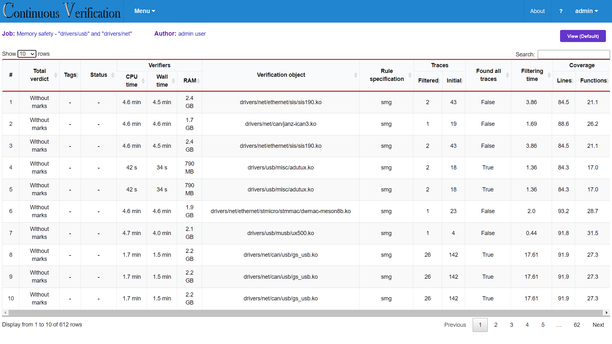
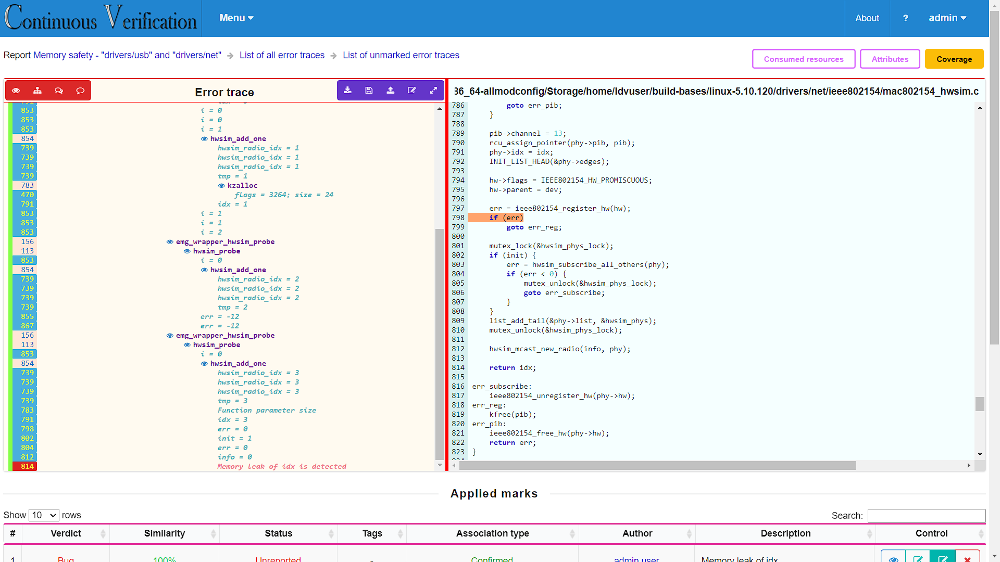
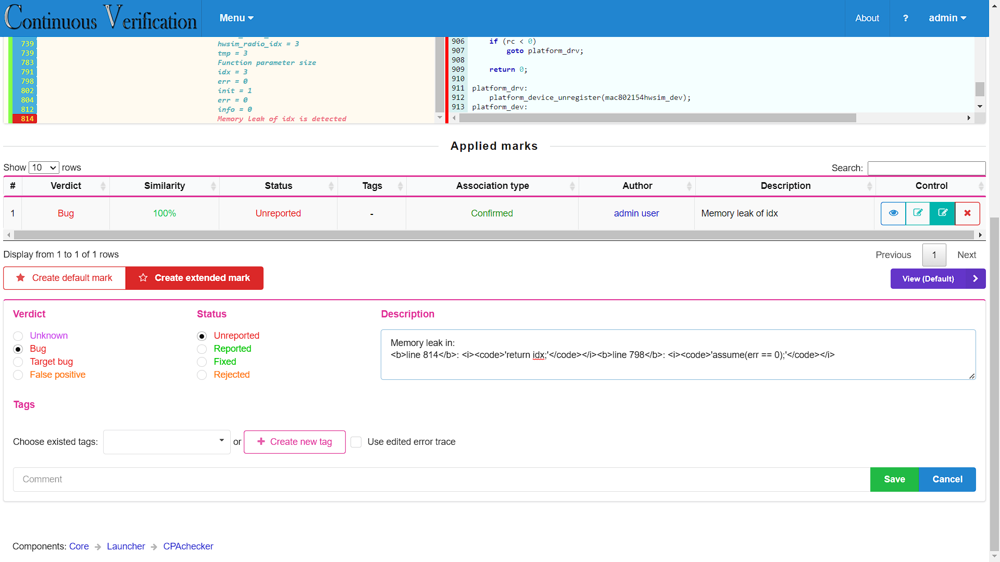

# Continuous Verification Visualizer (CVV)

Continuous Verification Visualizer (CVV) is a web-interface for visualization of 
verification results with support for continuous verification.

## Definitions

- `Verification task` is a program with a given entry point and a checked property.
For example, C-file and memory safety property, which checks correct usage of memory allocation and deallocation.
- `Verification tool` is a tool, that solves a given `verification task` and provides `verification result`.
Note, the result is provided in machine-readable format.
- `Verification result` contains:
  - a `correctness witness` (proof that property cannot be violated in a given program) or
  - a set of `error traces` (paths in source code from an entry point to the property violation) or
  - a reason of abnormal verifier termination (for example, resources exhaustion).

CVV visualises a set of `verification results` in a human-readable format, which are unified by some criteria.
For example, verification of a new version of an operating system.

CVV provides the following information for `verification results`:
- `error traces` with links to the source code in human-readable format;
- `correctness witnesses` is represented by invariants and conditions, which guarantee that the given property cannot be violated;
- logs for abnormal termination of `verification tool`;
- code coverage, which was obtained during verification;
- statistics of resource usage by different components (such as CPU time, memory usage, read/write operations ets.);
- comparison with other verification results, which allows to analyse only different results.

### Verification tasks preparation

In order to prepare and solve verification tasks [Continuous Verification framework](https://github.com/ispras/cv) (for generic programs)
or [Klever](https://github.com/ldv-klever/klever) (verification of Linux kernel modules) can be applied.

## Requirements

1. Ubuntu 16.04-22.04
2. Additional tools:
```shell
sudo apt install python3-dev postgresql python3-pip libpq-dev gettext
```
3. Python modules:
```shell
sudo pip3 install --upgrade setuptools
sudo pip3 install --upgrade pip
sudo pip3 install requests ujson graphviz django psycopg2 pluggy py attrs six more-itertools ply pytest atomicwrites pycparser psycopg2 sympy pytz
```

## Deployment

1. Execute basic script, which creates data base and default user (login=admin, password=admin):
```shell
deploys/deployment.sh <database name>
```

2. Start CV server with command:
```shell
./start.sh --host <host> --port <port>
```
or
```shell
nohup ./start.sh --host <host> --port <port> &
```
as a background process.

3. Set up user accounts via "Admin tools" (create additional users, change default passwords, etc.).
4. Create reports tree structure if needed via copying and editing root report.
5. Upload required reports.
6. Stop background server with command:
```shell
./stop.sh
```

## Web-interface usage

### Main page

This page combines a given verification results:

From there we can navigate to lists of `error traces` (`Unsafes: ...`), `correctness witnesses` (`Safes: ...`), logs
of abnormal termination (`Unknowns: ...`), code coverage statistics and consumed resource details.

### Unsafes page
List of all `error traces` represent found potential bugs:

They are distinguished by various attributes.

### Unsafe page
Each `error trace` shows a path in a source code to a potential bug with links to a source code:

A user may navigate through error trace by hiding and revealing some elements.

### Mark creation
A user analyses the given trace and decides whether it corresponds to a real bug or not (so called `False positive`).
After that a mark can be created, which then will be applied to all similar error traces:

When a new version will be verified, such marks help to skip already known `false positives` as well as to check if the found bug was actually fixed.

### Safe page
Each `correctness witness` shows important elements of proof (such as conditions and invariants):

Also, it contains code coverage and shows parts of a program, which were not analysed.
